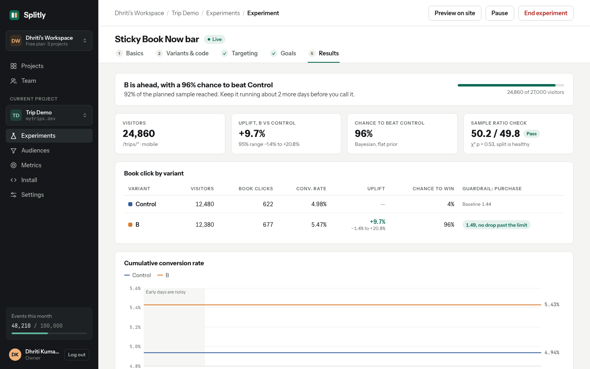
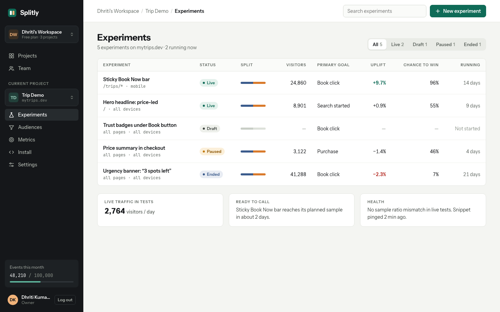
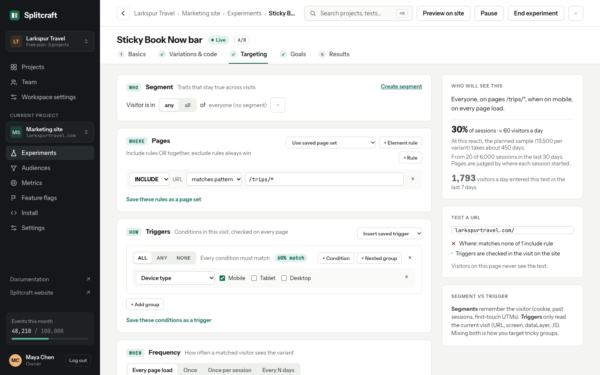
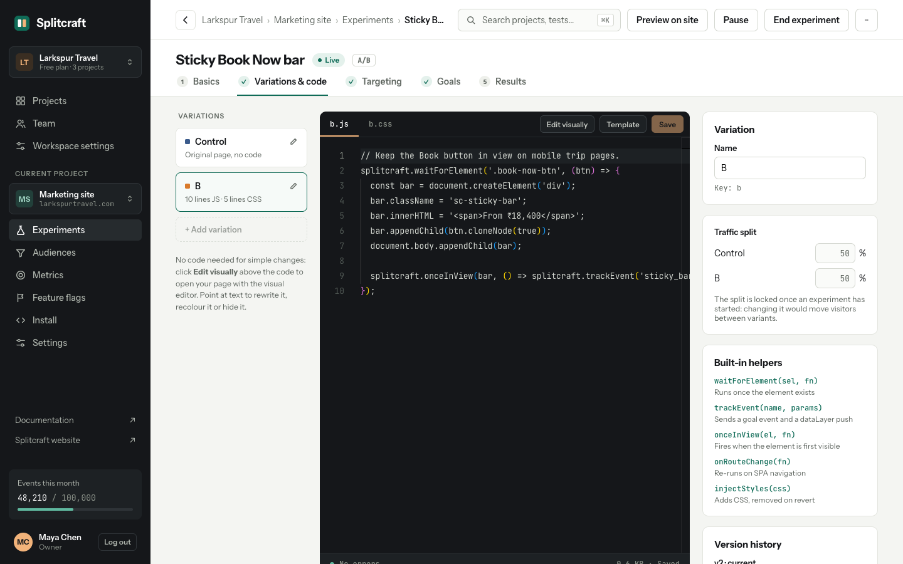
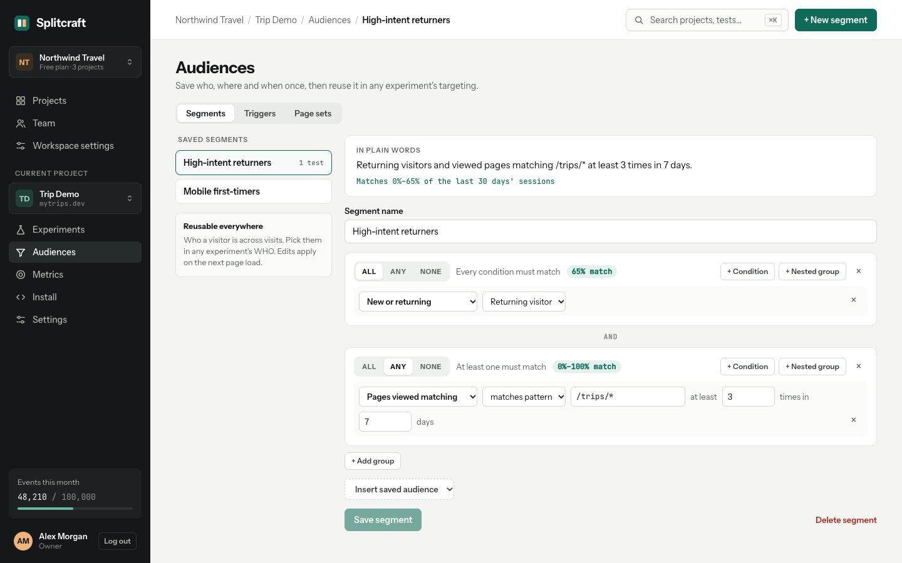
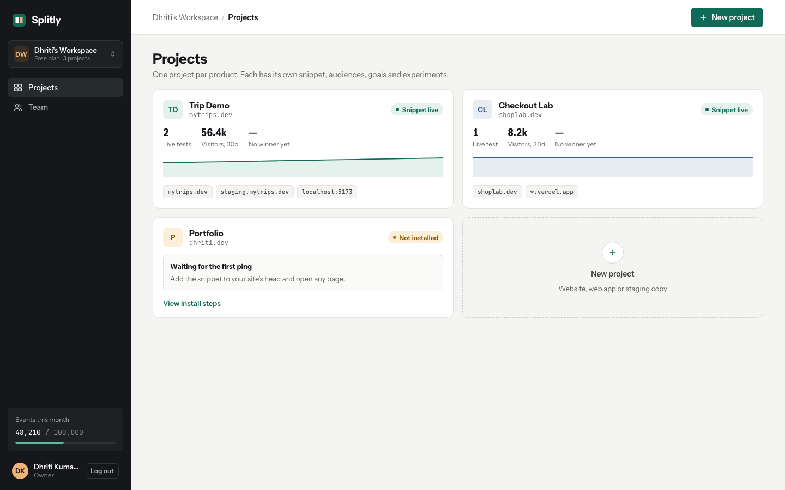
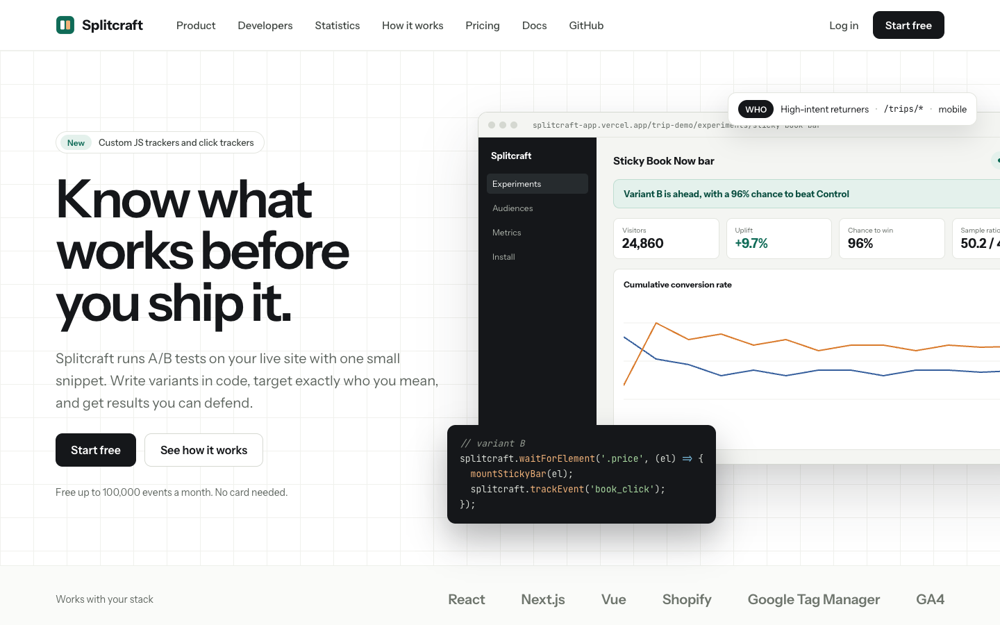
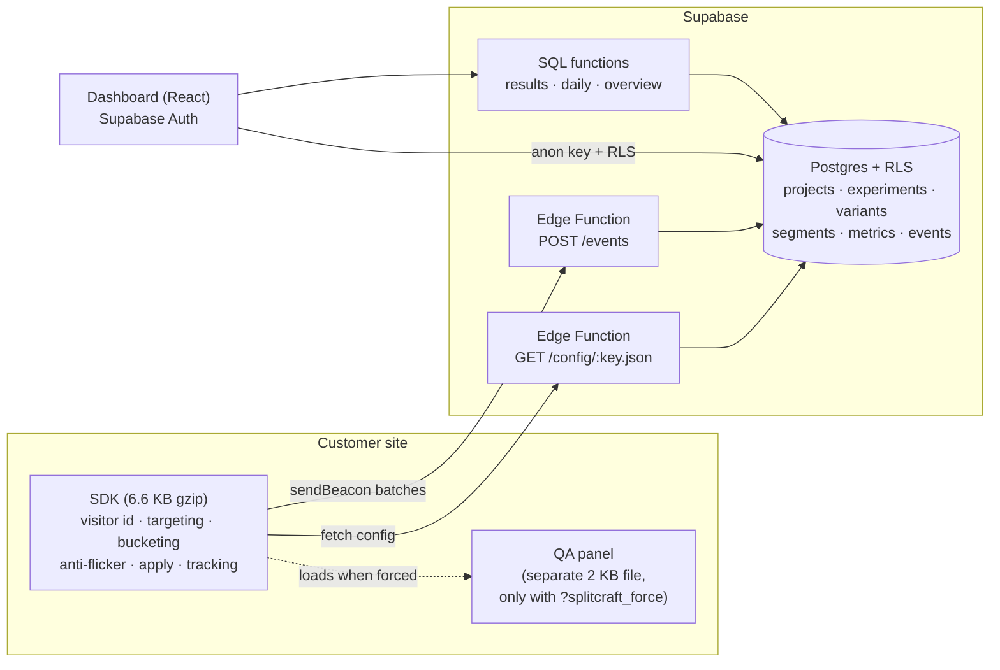

# Splitcraft

**Know what works before you ship it.** Splitcraft is a small A/B testing platform: a client-side SDK that
runs experiments on a live site, and a dashboard to build variants in code, target audiences, define
metrics and read results with honest statistics.

It is a portfolio project, built to understand how tools like Optimizely and AB Tasty work inside:
the bucketing, targeting, anti-flicker, tracking, QA mode and statistics are written from scratch.



## What it does

- **Variants in real code.** Write each variant's JS and CSS in a Monaco editor with typed `splitcraft.*`
  helpers, templates, a live syntax check and version history. Preview any variant on your site with
  `?splitcraft_force=experiment:variant`, which also opens a QA panel.
- **Targeting without limits.** WHO (saved segments) / WHERE (URL and element rules) / HOW (session
  triggers) / WHEN (frequency), built from nested ALL / ANY / NONE groups, with a plain-English summary
  and a URL tester that runs the SDK's own matcher.
- **Metrics from an event source.** Click trackers from CSS selectors (with selector health checks),
  pageview rules and custom JS trackers, measured as unique conversions, totals, sums or value per
  conversion, with a direction and a counting window.
- **Honest statistics.** Two-proportion z-test, Bayesian chance to win, uplift with its 95% range, a
  sample ratio mismatch check on every experiment, a sample-size planner, guardrails, and per-visitor
  values capped at the 99th percentile. The verdict says in plain words when a result is not ready.

|                                                                                   |                                                                                                    |
| --------------------------------------------------------------------------------- | -------------------------------------------------------------------------------------------------- |
|               |              |
|  |  |
|                                         |                                                        |

## Architecture



- **SDK** (`packages/sdk`): reads a visitor id (cookie, localStorage fallback), fetches the project's
  config, evaluates targeting, buckets with FNV-1a + a MurmurHash3 finaliser (`visitorId + experimentKey`
  → 0–9999; traffic uses a separate hash, so raising traffic never moves anyone), hides the page for at
  most 400 ms, applies the variant, sends one exposure per page, tracks goals with a delegated listener,
  and batches events with `sendBeacon`. It re-runs on SPA navigation.
- **Backend** (`supabase`): migrations with Row Level Security on every table, SQL functions for
  results, and two Edge Functions for the SDK (the service role key never leaves the server).
- **Dashboard** (`apps/dashboard`): React, React Router, TanStack Query, Monaco, Recharts.
- **Marketing site** (`apps/web`): pre-rendered at build time.

## Numbers

|                                     |                                                                          |
| ----------------------------------- | ------------------------------------------------------------------------ |
| SDK, main bundle                    | **6.9 KB** gzipped (budget 8 KB, checked in CI), no runtime dependencies |
| QA panel                            | 2.0 KB gzipped, a separate file loaded only in QA mode                   |
| Marketing site, Lighthouse (mobile) | Performance 100 · Accessibility 100 · Best practices 100 · SEO 100       |
| Tests                               | ~500 across SDK, dashboard, site, database and simulator                 |

The statistics are tested against the worked example in `docs/PRODUCT_SPEC.md` §6: Control
12,480 / 622 and B 12,380 / 677 give an uplift of +9.7% (95% range −1.4% to +20.8%), a 96% chance to
beat Control, and an SRM p-value of 0.53.

## Run it locally

Requirements: Node 22+. No Docker: database tests run on [PGlite](https://pglite.dev).

```sh
npm install
npm test                      # every workspace
npm run dev -w apps/dashboard # http://localhost:5173 (needs apps/dashboard/.env.local, below)
npm run dev -w apps/web       # http://localhost:5174
```

To look at any dashboard screen without Supabase, open
`http://localhost:5173/preview.html?path=/p/trip-demo/experiments/sticky/results`. It renders the
screen with the design's example data (development only).

### Supabase

1. Create a project at [supabase.com](https://supabase.com) (the free tier is enough).
2. Copy `apps/dashboard/.env.example` to `apps/dashboard/.env.local` and add the project URL and anon key.
3. Apply the schema and deploy the SDK endpoints:
   ```sh
   npx supabase login
   npx supabase link --project-ref <your-project-ref>
   npx supabase db push
   npx supabase functions deploy config --use-api
   npx supabase functions deploy events --use-api
   ```
4. In Supabase, set **Authentication › URL Configuration** to your dashboard URL.

### Hosting the site and the SDK

Both apps deploy to Vercel as two projects from this repo, configured by `apps/web/vercel.json` and
`apps/dashboard/vercel.json`. Import the repo twice and set **Root Directory** to `apps/web` and
`apps/dashboard`. The web project also serves the SDK at `https://<web-domain>/sdk/v1.js`.

Environment variables:

- `apps/dashboard`: `VITE_SUPABASE_URL`, `VITE_SUPABASE_ANON_KEY`, `VITE_SDK_URL` (the URL above) and
  `VITE_SITE_URL` (the web domain).
- `apps/web`: `VITE_DASHBOARD_URL` (the dashboard domain).

Add the dashboard domain to Supabase under **Authentication › URL Configuration** (Site URL and
`https://<dashboard-domain>/**` as a redirect URL).

### Demo data

`tools/simulator` fills an experiment with simulated traffic, bucketed exactly like the SDK and marked
`props.simulated = true`:

```sh
SUPABASE_URL=… SUPABASE_SERVICE_ROLE_KEY=… npm run simulate -w tools/simulator -- \
  --project prj_… --experiment sticky-book-now-bar --goal book_click \
  --rates control=0.05,b=0.055 --visitors 20000 --days 14
# remove it again
SUPABASE_URL=… SUPABASE_SERVICE_ROLE_KEY=… npm run simulate -w tools/simulator -- --project prj_… --delete
```

Keep the service role key in your shell only; never put it in a file in the repo.

## Repository

```
packages/sdk        the SDK (TypeScript, Vite library mode, Vitest)
apps/dashboard      the dashboard (React)
apps/web            the marketing site (React, pre-rendered)
supabase            migrations, Edge Functions, PGlite tests
tools/simulator     demo traffic
design              the design screens and tokens the UI follows
docs                product spec, decisions, build plan
```

## Known gaps

Things the designs or spec describe that are not built yet:

- Browsing and Web Vitals metrics (the SDK doesn't collect them yet).
- The visitor's country in the config.
- "Pick on page" and a Chrome preview extension (planned as v1.1).

`docs/DECISIONS.md` explains the choices behind these and the rest of the design.
